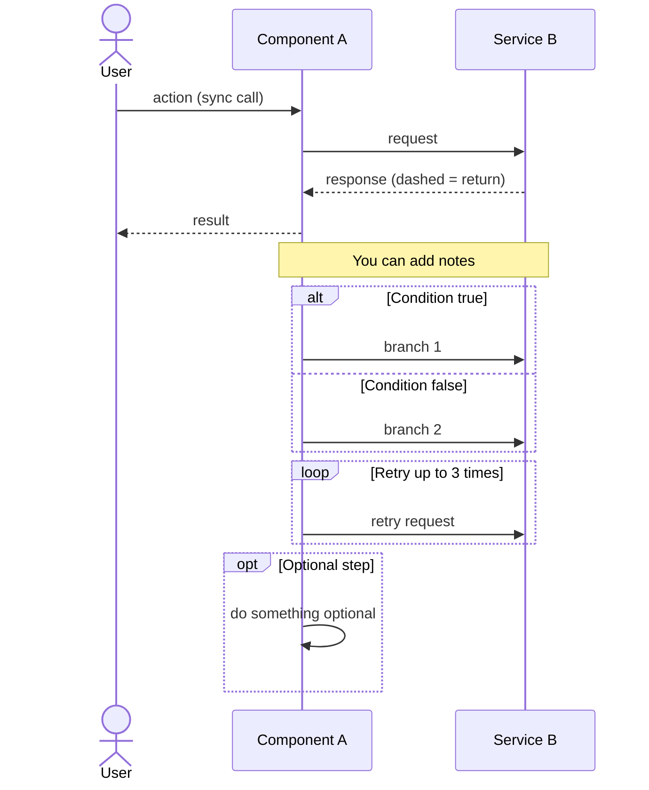
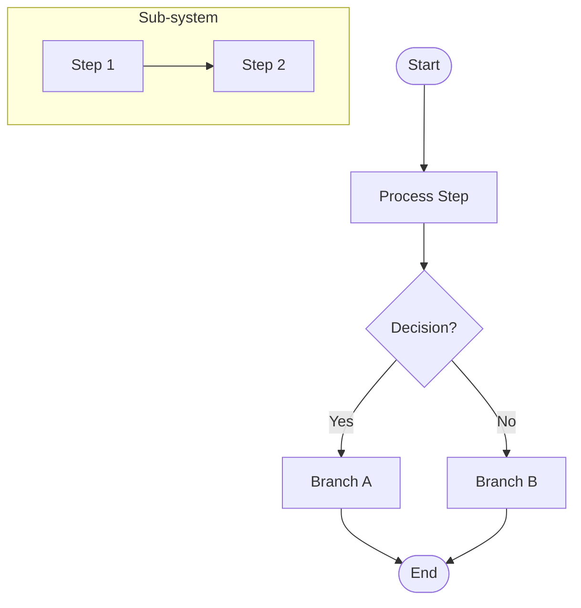
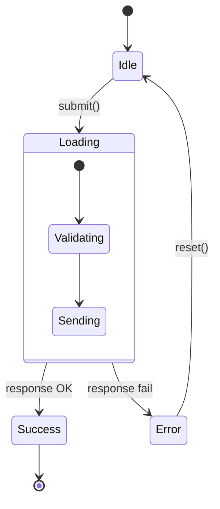
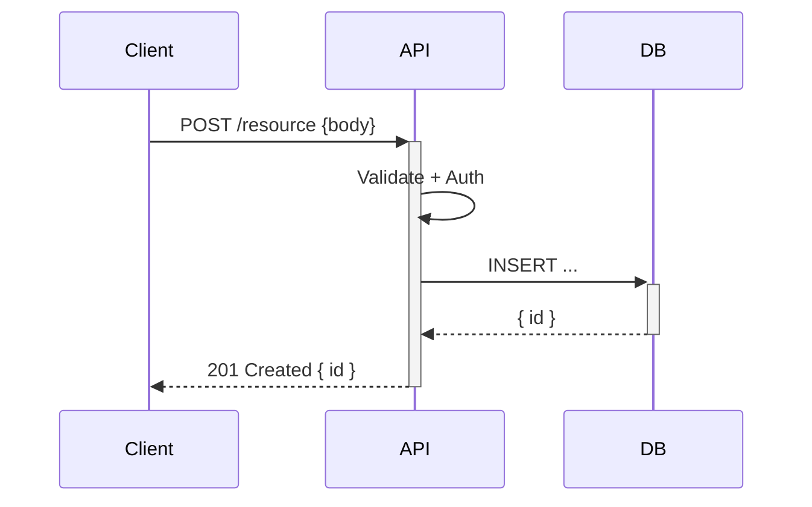
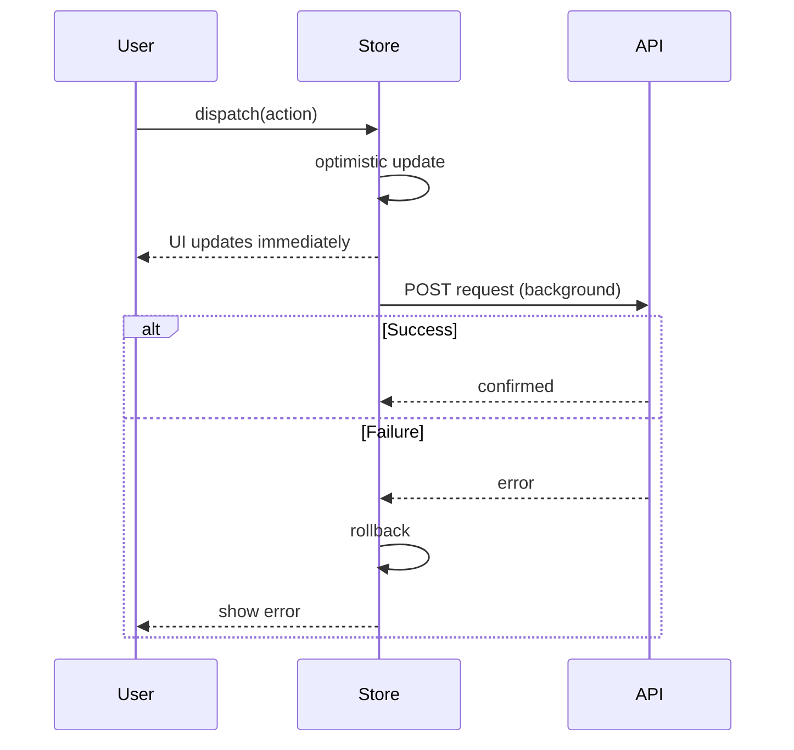
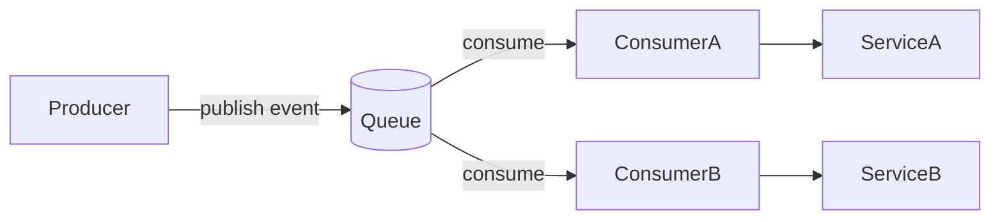
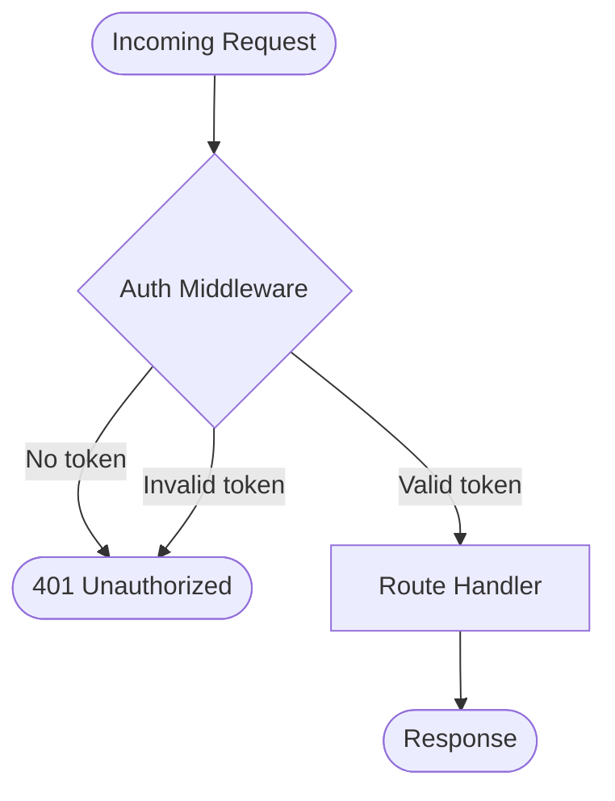

# Mermaid Cheatsheet for Data Flow Diagrams

## sequenceDiagram — for request/response flows



**Arrow types:**
- `A->>B: msg` — solid arrow (call / send)
- `A-->>B: msg` — dashed arrow (return / response)
- `A-)B: msg` — async (fire and forget)
- `A-xB: msg` — message that destroys target

**Activation boxes** (show when something is "active"):
```
A->>+B: start
B-->>-A: end
```

---

## flowchart TD — for branching / decision flows



**Node shapes:**
- `[Text]` — rectangle (process)
- `{Text}` — diamond (decision)
- `(Text)` — rounded rectangle
- `([Text])` — stadium / pill (start/end)
- `[[Text]]` — subroutine
- `[(Text)]` — cylinder (database)
- `>Text]` — flag (annotation)

**Edge types:**
- `A --> B` — arrow
- `A --- B` — line, no arrow
- `A -- label --> B` — labelled arrow
- `A -.-> B` — dashed arrow
- `A ==> B` — thick arrow

**Direction:**
- `TD` / `TB` — top to bottom
- `LR` — left to right
- `BT` — bottom to top
- `RL` — right to left

---

## stateDiagram-v2 — for state machine flows



---

## Common Patterns

### HTTP Request/Response


### Optimistic UI Update


### Pub/Sub / Event Queue


### Auth Middleware
